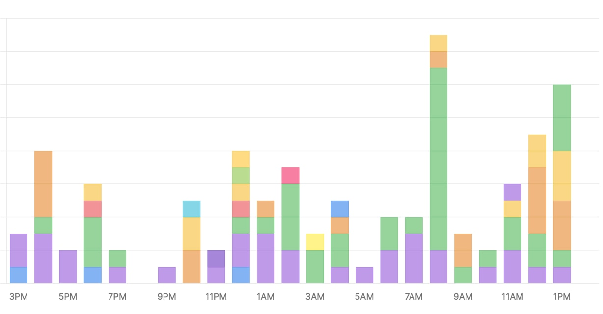

# Umami Analytics Client for Python

Analytics client for privacy-preserving, open source [Umami platform](https://umami.is) based on 
`httpx` and `pydantic`. 

`umami-analytics` is intended for added custom data to your Umami instance (self-hosted or SaaS). Many umami events can supplied directly from HTML via their `data-*` attributes. However, some cannot. For example, if you have an event that is triggered in your app but doesn't have a clear HTML action you can add custom events. These will appear at the bottom of your Umami analtytics page for a website.

One example is a **purchase-course** event that happens deep inside the Python code rather than in HTML at [Talk Python Training](https://training.talkpython.fm). This is what our events section looks like for a typical weekend day (US Pacific Time):



## Focused on what you need, not what is offered

The [Umami API is extensive](https://umami.is/docs/api) and much of that is intended for their frontend code to be able to function. You probably don't want or need that. `umami-analytics` only covers the subset that most developers will need for common SaaS actions such as adding [custom events](https://umami.is/docs/event-data). That said, PRs are weclome.

🔀 **Async is supported but not required** for your Python code. For functions that access the network, there is a `func()` and `func_async()` variant that works with Python's `async` and `await`.


## Core Features

* ➕ **Add a custom event** to your Umami analtyics dashboard.
* 🌐 List all websites with details that you have registered at Umami.
* 🔀 Both **sync** and **async** programming models.
* ⚒️ **Structured data with Pydantic** models for API responses.
* 👩‍💻 **Login / authenticate** for either a self-hosted or SaaS hosted instance of Umami.
* 🥇Set a **default website** for a **simplified API** going forward.

See the usage example below for the Python API around these features.

## Installation

Just `pip install umami-analytics`

## Usage

```python

import umami

umami.set_url_base("https://umami.hostedbyyouorthem.com")
login = umami.login(username, password)

# Skip the need to pass the target website in subsequent calls.
umami.set_website_id('cc726914-8e68-4d1a-4be0-af4ca8933456')
umami.set_hostname('somedomain.com')

# List your websites
websites = umami.websites()

# Create a new event in the events section of the dashboards.
event_resp = umami.new_event(
    website_id=sit'a7cd-5d1a-2b33', # Only send if overriding default above
    event_name='Umami-Test',
    title='Umami-Test', # Defaults to event_name if omitted.
    hostname='somedomain.com', # Only send if overriding default above.
    url='/users/actions',
    custom_data={'client': 'umami-tester-v1'},
    referrer='https://some_url')

# Call after logging in to make sure the auth token is still valid.
umami.verify_token()
```


## Want to contribute?

See the [API documentation](https://umami.is/docs/api) for the remaining endpoints to be added. PRs are welcome. But please open an issue first to see if the proposed feature fits with the direction of this library.

Enjoy.
